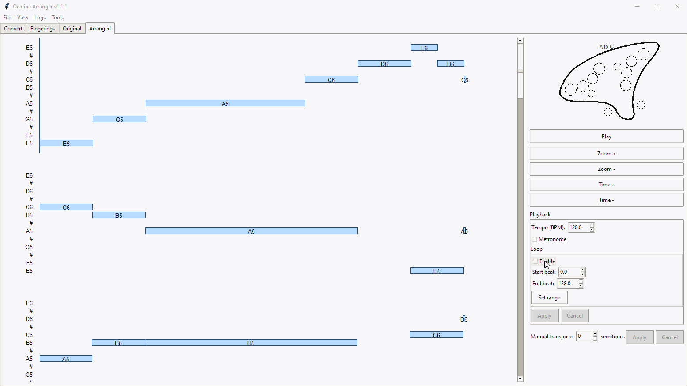
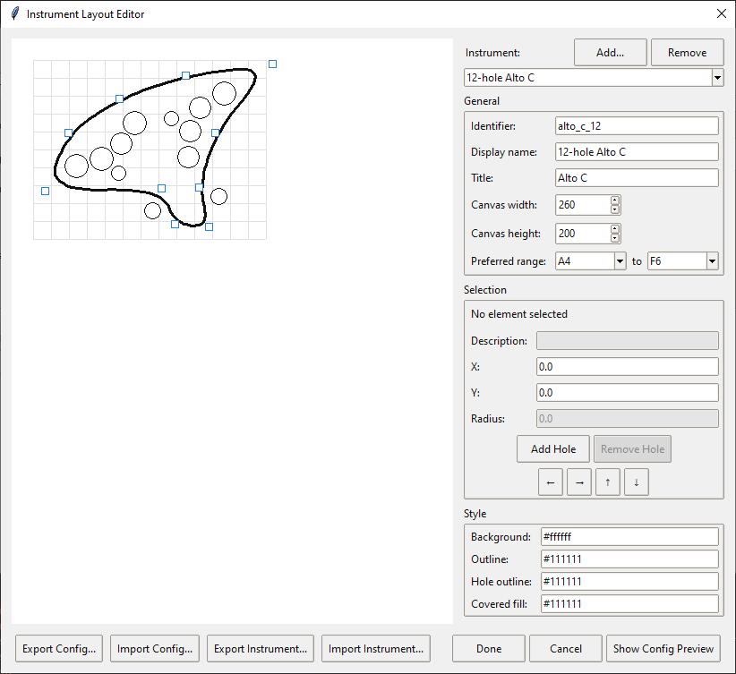
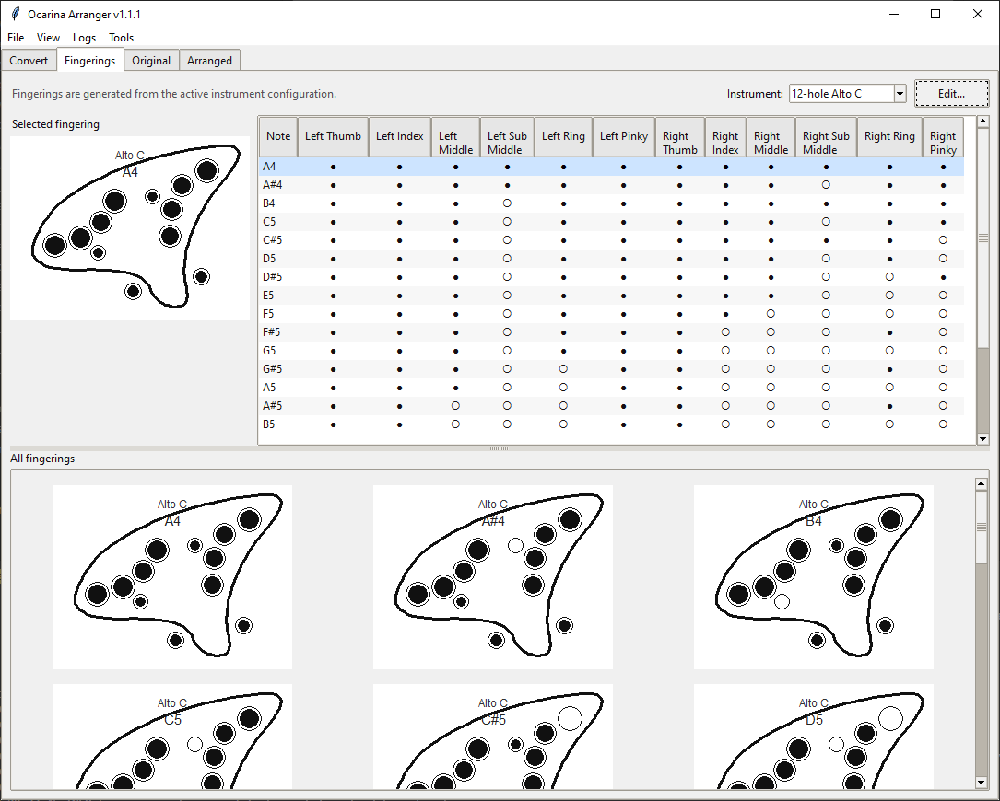
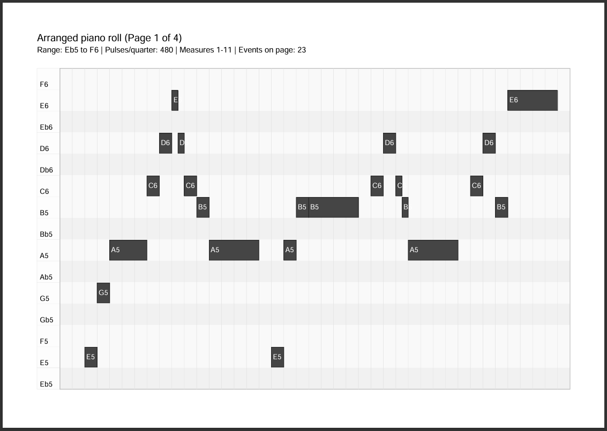
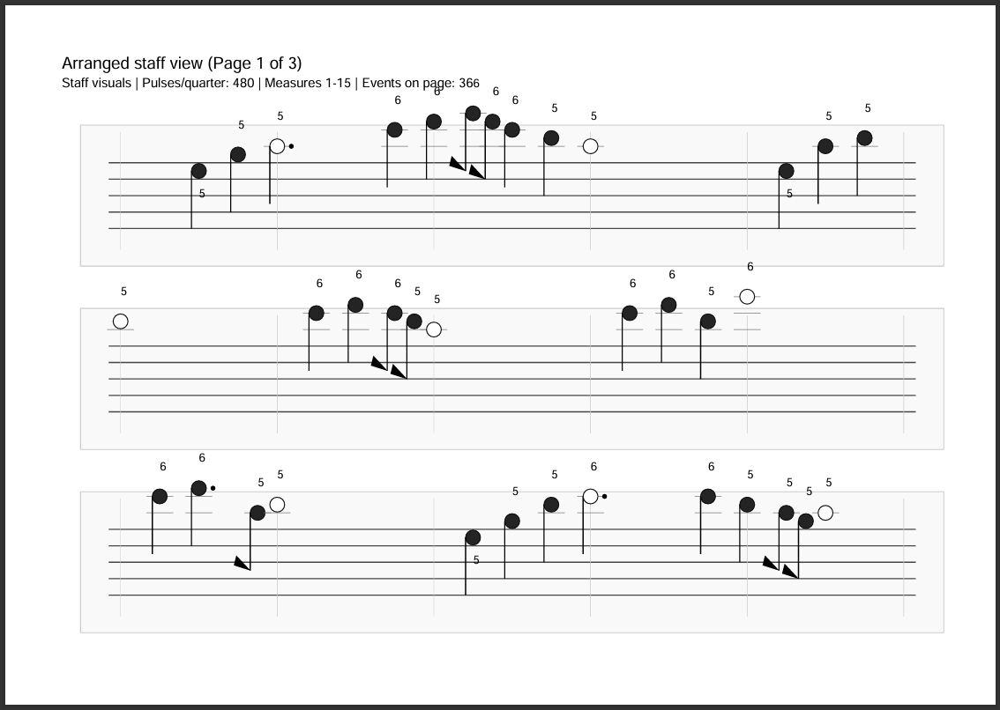
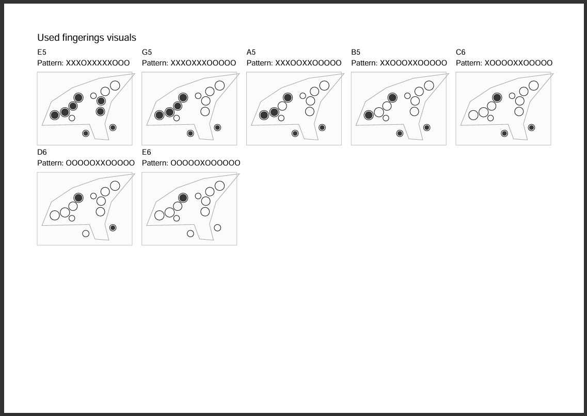
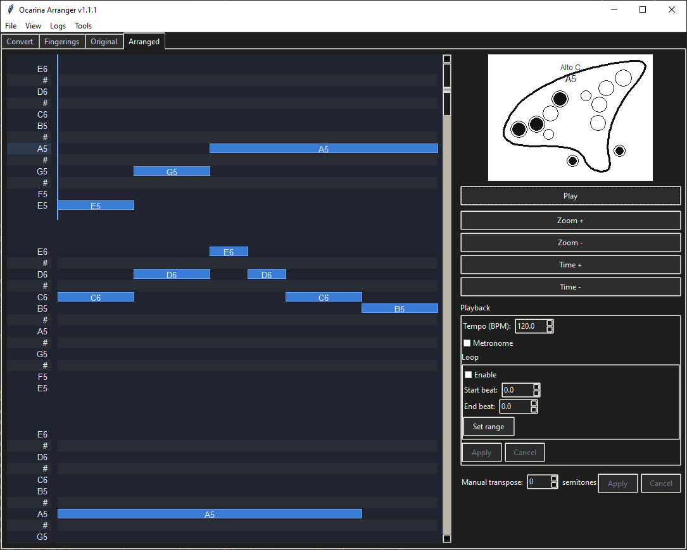

# Ocarina Arranger

**Disclaimer**: This is a vibe-coded project, it works for me and I find it useful. Use at your own risk, no warranties provided.

## Run

### Option 1: download the Release binary (Windows and Linux only). Linux is non-tested.

### Option 2:

#### Create an isolated virtual environment

Keeping the project inside its own virtual environment avoids version
conflicts with any globally installed packages. Create one alongside the
repository (replace `.venv` with your preferred directory name if needed):

```bash
python -m venv .venv
```

Activate it and upgrade `pip` so dependency resolution stays reliable:

```bash
source .venv/bin/activate
python -m pip install --upgrade pip
```

On Windows, activate with:

```powershell
.venv\Scripts\Activate.ps1
python -m pip install --upgrade pip
```

Install the pinned runtime requirements:

```bash
python -m pip install -r requirements.txt
```

Run the application from the same environment:

```bash
python -m ocarina_gui.app
```

## Main features

1. Audio playback - both original and arranged tracks
2. Tempo change
3. Transposition
4. Metronome
5. Loop for faster learning

## Loop feature



## Instrument editor



## Fingerings



## PDF export





## Dark theme



## Community

Join our Discord community on [Discord](https://discord.gg/xVs5W6WR).

## Notes

- Conversion pipeline: transpose to C/Am -> collapse chords -> enforce A4-F6 -> (optional) favor lower register.

## Arranger troubleshooting

1. Try to use default settings first (reset to default if already changed).
2. If you don't like the output, change to "Use ranked candidate" first and re-arrange.
3. If it still doesn't look good, expand "Show advanced arranger controls" and change "Range clamp penalty" to 5, re-arrange. This may cause the notes to be out of instrument range. Use manual transposition to move the song up/down as needed.

## Grace note configuration

The **Show advanced arranger controls** panel now exposes a dedicated **Grace notes** section
that controls how ornamental notes are realized during import and how aggressively they are
preserved during arranging:

- **Policy** – choose between tempo-weighted theft (default) or the fixed "steal" behaviour.
- **Fractions** – set up to three proportional weights that apportion time from the anchor note
  to each grace in a chain.
- **Max chain** – cap how many graces are allowed to survive before the anchor.
- **Anchor minimum** – ensure the principal note keeps at least the selected fraction of a beat
  after theft.
- **Fold/Drop toggles** – decide whether out-of-range graces are folded into range or dropped.
- **Tempo thresholds** – configure the slow/fast BPM limits used for pruning at extreme speeds.
- **Grace bonus** – control the difficulty reduction awarded when graces remain in the output.

The viewmodel, project manifests and importer all honour these settings, so the configured grace
behaviour survives project saves and reloads without additional tweaks.

## Debug logs

When troubleshooting preview playback the app now records verbose diagnostics to
`~/.ocarina_arranger/logs/preview.log` (or to the directory specified via the
`OCARINA_LOG_DIR` / `OCARINA_LOG_FILE` environment variables). Share this file
when reporting audio issues so we can inspect the detailed playback timeline.

## Project archives

Saved `.ocarina` project bundles include a `manifest.json` file describing the
active transform settings. The `settings.selected_part_ids` list records the
MusicXML part identifiers that were chosen when the project was saved. When the
field is missing (in older manifests) the loader falls back to including all
parts from the source score.

## Automatic updates (Windows)

On Windows, the application can automatically check GitHub releases on startup and
download the portable ZIP package when a newer version is available. Automatic
checks are disabled by default; enable them through **Tools → Enable Automatic
Updates** and the preference will be remembered between sessions. Manual checks are
available through
**Tools → Check for Updates...**, which surfaces the release notes (when
available) before downloading a newer release. To exercise the update flow
locally without publishing a release, point the application at a directory
containing a `release.json` manifest by setting the
`OCARINA_UPDATE_LOCAL_DIR` environment variable. The manifest should provide the
fields `version`, `installer` and either `sha256` or `sha256_file`, with
optional `release_notes` and `entry_point` strings, for example:

```json
{
  "version": "1.2.3",
  "installer": "OcarinaArranger-windows.zip",
  "sha256": "<sha256 hex digest>",
  "release_notes": "Bug fixes and improvements.",
  "entry_point": "OcarinaArranger/OcarinaArranger.exe"
}
```

When `sha256_file` is specified it must point to a sibling file containing the
digest (in the common `<hash>  <filename>` format). After verifying the hash,
the updater stages the portable bundle and replaces the existing
`OcarinaArranger/` directory (which also contains the `_internal` folder with
the bundled DLLs and Python runtime) before relaunching from the same
location.

## Package Layout

- GUI code now lives in the `ocarina_gui/` package, split into focused modules (`app.py`, `piano_roll.py`, `staff.py`, `fingering.py`, etc.).
- Core music logic remains in the `ocarina_tools/` package.
- `ocarina_gui/__init__.py` re-exports `App` and the exporter helpers so existing imports continue to work.
- Tests import through the package roots; see `tests/conftest.py` for the path helper.

## Running Tests

Install the test dependencies inside the project virtual environment first:

```
python -m venv .venv
. .venv/bin/activate
pip install -r requirements.txt
```

Then run the suite from the same activated environment (or by invoking the
virtualenv binaries directly):

```
xvfb-run -a .venv/bin/pytest
```

On Windows the activation command is `.venv\Scripts\activate` and the
pytest binary lives under `.venv\Scripts\pytest.exe`.

For the roadmap that tracks behaviour-driven UI coverage, see
[`docs/e2e_test_plan.md`](docs/e2e_test_plan.md).

Troubleshooting tips and additional guidance for running the suite live in
[`docs/testing/README.md`](docs/testing/README.md).

## Third-party license manifest

Whenever you add or upgrade a runtime dependency (anything listed in
`requirements.txt` before the `# test dependencies` sentinel), regenerate the
aggregated license document so the application continues to ship compliant
license information. The runtime entries are pinned to exact versions so the
manifest stays reproducible across environments—update the pin along with the
license file whenever you deliberately bump a dependency. From an environment
where the dependencies are installed, run:

```
python -m scripts.build_third_party_licenses
```

This rewrites `THIRD-PARTY-LICENSES` in place by querying the installed
distributions for their license texts and metadata. The
`tests/unit/test_third_party_licenses.py` regression test fails if the checked-in
file falls out of sync, so running `pytest` before committing will confirm the
manifest matches the current dependencies. If the test reports that a runtime
dependency is missing or the installed version does not satisfy the pinned
requirement, reinstall the runtime stack first:

```
pip install --upgrade -r requirements.txt
```

The generator only ever inspects what is currently installed, so keeping your
virtualenv in lockstep with `requirements.txt` avoids the subtle manifest drift
seen when stale wheels remain in the environment.

### Polyphonic MIDI regression

The automated regression that exercises a polyphonic MIDI import/export round-trip expects a local sample file that you
provide yourself. Point the test suite at a polyphonic MIDI file by exporting an environment variable before running pytest:

```
export OCARINA_TEST_POLYPHONIC_MIDI=/path/to/your/polyphonic.mid
python -m pytest tests/test_exporters.py::test_polyphonic_midi_roundtrip_preserves_events
```

for Windows:

```
set OCARINA_TEST_POLYPHONIC_MIDI=C:\path\to\your\polyphonic.mid
```

If the variable is unset the test is skipped, so regular `python -m pytest` runs still succeed without the optional asset.
