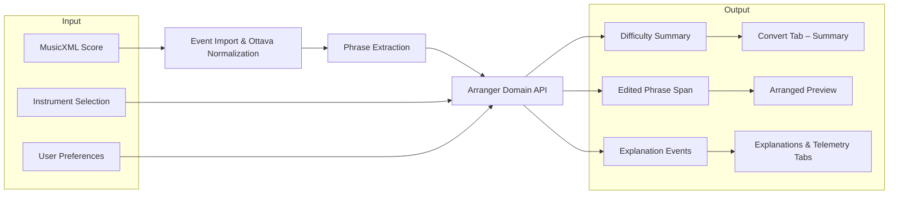
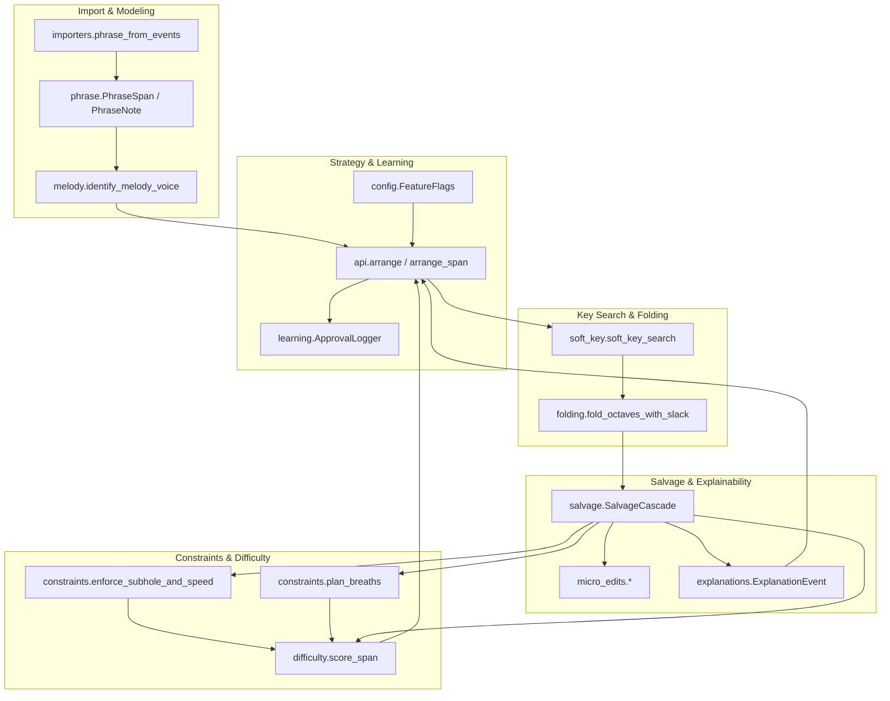
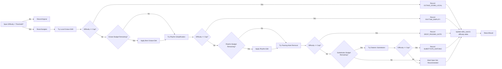

# Arranger Algorithm Overview

This document explains how the best-effort arranger processes MusicXML scores
into playable ocarina phrases. It complements the implementation plan by
mapping each stage to the code modules and surfacing the data that flows between
layers. Three Mermaid diagrams illustrate the system at different zoom levels.

## High-Level Pipeline

The top-level view shows how importer utilities, the arranger domain package,
and the desktop UI cooperate to generate feedback for the player.

Key takeaways:

- Importers resolve notation (8va/8vb, tuplets, voices) into normalized events
  before the domain layer reasons about pitches.
- `domain.arrangement.api.arrange` is the orchestration point that applies key
  search, octave folding, constraints, and salvage budgets.
- The UI consumes three products: edited phrases for playback/preview,
  difficulty summaries for ranking instruments, and explanation payloads for
  transparency.

## Mid-Level Component Interactions

The mid-level diagram highlights how the arranger domain package decomposes the
work. Each subgraph corresponds to a module family under `domain/arrangement/`.

Highlights:

- Melody isolation runs before key search so polyphonic MusicXML inputs reduce
  to a single melodic voice.
- Soft key search ranks transpositions; the winning candidates enter the octave
  folding DP before the salvage cascade applies micro edits.
- Constraint helpers (subhole speed, breath planning) and the difficulty model
  feed both the salvage decisions and the returned summary metrics.

## Low-Level Salvage Flow

The low-level diagram zooms into `SalvageCascade.run`, showing how edit budgets
and explanation events cooperate to keep each span deterministic.

Implementation notes:

- Each ladder stage is bounded by `SalvageBudgets` so a span can consume at most
  one octave move, one rhythm simplification, one substitution, and a finite
  number of total steps before the cascade stops.
- After each edit, `ExplanationEvent` captures the action, reason code, span ID,
  and difficulty delta. The cascade persists these payloads so the UI can
  display them verbatim.
- When the cascade exhausts budgets without bringing the span below the target
  difficulty, it marks the specific span as “not recommended” rather than
  rejecting the full arrangement.

## Further Reading

- [Arranger Implementation Plan](arranger_best_effort_plan.md) – milestone
  breakdown, ROI ordering, and testing strategy.
- `tests/integration/test_arranger_polyphonic.py` – regression suite covering
  melody isolation, octave folding, subhole enforcement, breath planning, and
  range clamping.
- `services/arranger_preview.py` – service that adapts domain results into the
  desktop UI’s arranged preview, including diagnostic logging and monophonic
  sanitization.
