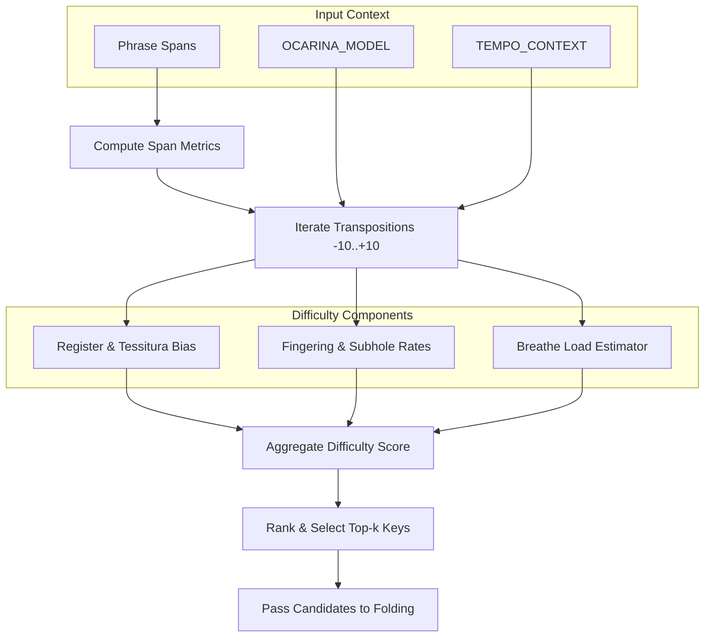
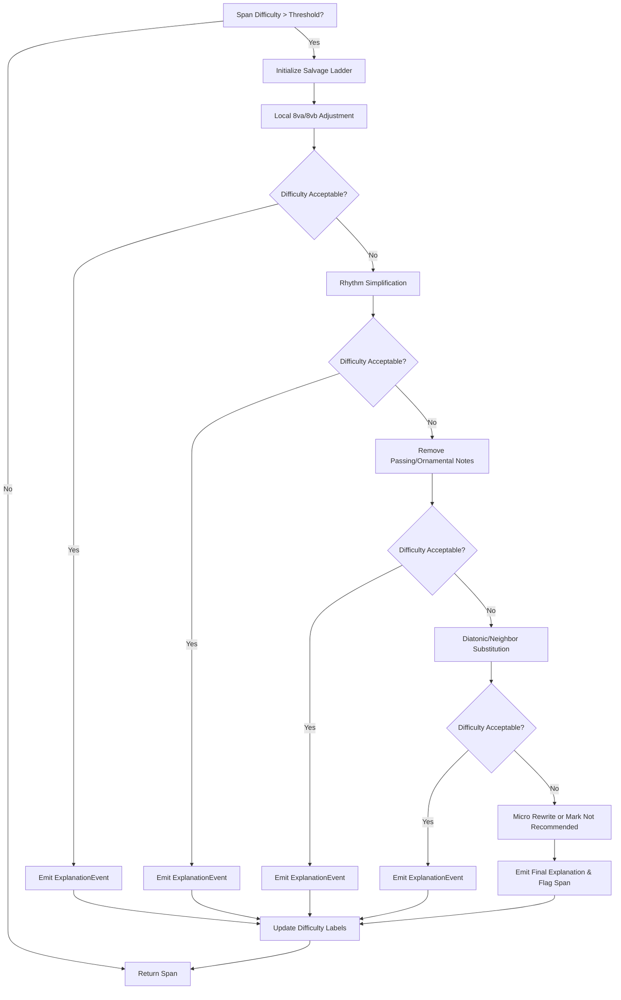

# Best-Effort Arranger Algorithm – Implementation Plan

## 1. Context & Goals
- Adopt a salvage-first policy: never declare an arrangement impossible; instead, apply a prioritized cascade of fixes to problematic spans.
- Prefer the currently selected instrument while supporting an optional starred-instrument evaluation path.
- Normalize ottava markings and retain provenance for explainability.
- Deliver incremental, test-driven improvements ordered by the highest return on investment (ROI = Impact / Difficulty).
- Maintain observability so we can explain each automated edit and learn from user approvals.

## 2. Guiding Principles
1. **Best-effort policy** – Always attempt to salvage each problematic span by escalating through the ladder: soft key scoring → local 8va/b folding → rhythm simplification → diatonic/neighbor substitution → micro rewrites →, if still excessive, flag the span "not recommended" but keep the rest.
2. **Incremental delivery** – Ship the highest ROI upgrades first (8va normalization, micro-edit library, optional instrument chooser) before tackling more complex DP and learning loops.
3. **Explainability & logging** – Capture `{bar, action, reason, before→after, difficulty Δ}` for every automatic fix to support tuning and user trust.
4. **Data-driven difficulty** – Replace hard caps with a continuous difficulty model covering finger transitions, subholes, leaps, tessitura, and breath load.
5. **User preference aware** – Respect the current instrument by default, optionally scoring starred instruments to pick the most playable result.

## 3. Deliverables & Milestones
| Phase | Scope | Key Deliverables | Dependencies |
|-------|-------|------------------|--------------|
| **P1. Foundations** | Parsing & local edits | 1. Ottava normalization with `ottava_source` metadata. 2. Library of common micro edits (drop ornamental 1/8, lengthen pivotal note, short-span 8va/b shift). 3. Acceptance tests covering import + micro edits. | None |
| **P2. Optional Instrument Selection** | Instrument-aware scoring | 1. Instrument chooser respecting current instrument with optional starred evaluation path (tie-break: Hard/VeryHard counts → Medium counts → tessitura fit). 2. Tests with mocked instrument sets and difficulty outputs. 3. Public API `domain.arrangement.api.arrange` returning ranked comparisons. | P1 difficulty scoring hooks |
| **P3. Soft Key Search & Salvage Cascade** | Global key selection + local fixes | 1. Soft key scoring returning top-k candidates (no hard fail). 2. Salvage cascade orchestrator applying steps 1–4 with span isolation. 3. Difficulty analyzer returning continuous score + labels. | P1 normalization, micro edits |
| **P4. Advanced Constraints** | Playability refinements | 1. Subhole & speed constraints with automatic ornamental substitutions. 2. Breath planning heuristics (tempo-aware T limits). 3. Tessitura bias + high-octave duplicate testing. 4. Tests simulating high-register and high-speed passages. | P3 difficulty metrics |
| **P5. Explanations & Learning Loop** | Observability & feedback | 1. Explanations channel emitting structured actions. 2. Logging of user approvals to persistent store for later weight tuning. 3. ADR on data governance & privacy. | Prior phases emitting detailed difficulty metrics |
| **P6. DP with Slack & Continuous Improvement** | Robust folding & future-proofing | 1. Dynamic programming octave folding with substitute state and finite penalties. 2. Parameterized difficulty weights + configuration. 3. Evaluation harness comparing arrangements against historical approvals. | P3 cascade, P5 logging |

## 4. Testing Strategy
- **Unit Tests**
  - Ottava normalization: ensure imported notes store absolute pitch and provenance.
  - Micro edits: verify each edit transforms sample phrases and respects SRP.
  - Instrument chooser: validate tie-breaking logic using synthetic difficulty data.
  - Soft key scoring: confirm scoring favors playable keys without hard failures.
  - Salvage cascade: feed contrived passages to guarantee escalation order.
  - Difficulty model: compute scores for boundary cases (register, breath, subholes).
- **Integration Tests**
  - Arrange pipeline with mocked instrument models to ensure salvage ladder applies and explains actions.
  - Subhole/speed constraints interacting with rhythm simplification.
- **UI/Viewmodel Tests** (future)
  - Ensure starred instruments can be toggled and propagate to the arranger service.
- **Performance Guardrails**
  - Benchmark salvage cascade on representative pieces to hold runtime within acceptable limits.

## 5. Technical Considerations
- Extend `OCARINA_MODEL` to expose subhole change rates, alternative fingerings, and high-register penalties.
- Represent difficulty thresholds as configuration, allowing user-level tuning while keeping defaults (Easy 0.35, Medium 0.65, Hard 0.9, VeryHard 1.1).
- Maintain a `TopKKeyResult` structure capturing key, fit score, and rationale for auditability.
- Design micro-edit functions as pure transformations over a `PhraseSpan` object to keep the domain layer side-effect free.
- For explanations, define a lightweight event type to serialize the `{bar, action, reason, before→after, difficulty Δ}` payload.

## 6. Open Questions & Follow-ups
1. How will starred instruments be configured in the UI, and do we require persistence beyond the current session?
2. What telemetry storage is available for logging user approvals while respecting privacy constraints?
3. Should the salvage cascade expose an interactive preview allowing users to accept/reject specific edits before finalizing?
4. Do we need heuristic limits on consecutive micro edits within a span to avoid over-editing a phrase?
5. What coverage targets are realistic for DP-with-slack once the state space expands to include substitution options?

## 7. Next Actions (Two-Iteration Horizon)
1. Finalize acceptance tests for ottava normalization and micro edits (P1).
2. Implement instrumentation stubs for difficulty metrics so P2–P4 can reuse them.
3. Draft ADR on salvage ladder rationale once initial implementation stabilizes.
4. Align with UI team on starred-instrument toggles and reporting needs for explanations channel.
5. Schedule benchmarking session to set baseline runtime before introducing DP with slack.

### Recent Progress

- Implemented structured explanation events that capture `{bar, action, reason, before→after, difficulty Δ}` for each salvage step.
- Added an approval logging pathway that persists user-accepted proposals for future weight tuning experiments.
- Built a configurable octave-folding DP with substitution slack and an evaluator that benchmarks new arrangements against historical approvals.
- Gated the octave-folding DP behind a `FeatureFlags.dp_slack` toggle so the default pipeline matches the pre-DP baseline while allowing opt-in evaluation.
- Added a best-effort results panel in the Convert tab with summary, explanations, and telemetry tabs wired to the arranger v2 state.

## 8. Current Arranger Implementation Overview

The best-effort arranger is now wired end-to-end from import through evaluation. The table below captures the major building blocks and their primary responsibilities.

| Area | Key Modules | Responsibilities |
|------|-------------|------------------|
| **Import & Normalization** | `ocarina_tools.events`, `shared.ottava` | Resolve 8va/8vb spanners to absolute pitches, persist `ottava_source`, and emit `NoteEvent` objects enriched with dynamic markings. |
| **Phrase Modeling & Micro Edits** | `domain.arrangement.phrase`, `domain.arrangement.micro_edits` | Represent contiguous spans as immutable `PhraseSpan`/`PhraseNote` sequences and expose reusable micro edits (drop ornaments, lengthen anchors, octave shifts). |
| **Soft Key Search & Difficulty Scoring** | `domain.arrangement.soft_key`, `domain.arrangement.constraints` | Evaluate transpositions across the instrument range with continuous difficulty metrics, honoring tessitura bias, subhole limits, and breath planning. |
| **Salvage Cascade & Explanations** | `domain.arrangement.salvage`, `domain.arrangement.explanations` | Orchestrate the ladder of fixes, record each applied action with versioned payloads `{schema_version, bar, action, reason, reason_code, span_id, key_id, difficulty Δ}`, and expose telemetry for UI surfacing. |
| **Octave Folding with Slack** | `domain.arrangement.folding` | Run a DP that keeps local ±12 shifts and diatonic substitutions in play, allowing finite penalties instead of hard failures. |
| **Learning Loop & Evaluation Harness** | `domain.arrangement.learning` | Persist accepted arrangements, compare fresh proposals against historical approvals, and feed continuous improvement experiments. |

### Public Arranger API

- **Entry point:** `domain.arrangement.api.arrange(span, *, instrument_id, starred_ids=None, strategy='current', ...)`
  - `strategy='current'` evaluates only the provided `instrument_id`, ignoring any starred identifiers.
  - `strategy='starred-best'` ranks the current instrument alongside each `starred_id` using the Hard+VeryHard duration → Medium duration → tessitura distance tiebreakers and returns the ordered comparisons.
  - The return value is an `ArrangementStrategyResult` exposing the chosen instrument plus the ordered comparison list so services can surface the scoring rationale to callers.
- **Instrument registry:** Call `domain.arrangement.config.register_instrument_range()` during start-up to map `instrument_id` values to `InstrumentRange` objects. Tests can use `clear_instrument_registry()` to isolate scenarios.

### High-Level Data Flow

### Mid-Level Workflow: Soft Key Search & Difficulty Scoring

- The soft key sweep now evaluates ±10 semitones so near-miss keys outside the
  previous ±6 window can still feed the salvage cascade.
- Difficulty aggregation incorporates a **leap exposure** penalty that raises
  the score when consecutive notes jump more than a tritone, ensuring widely
  spaced figures stay prioritized for salvage edits.

### Mid-Level Workflow: Salvage Cascade & Explanations

## 9. Trying the Arranger v2 UI (Step-by-Step)

1. **Launch the desktop app and open the _Convert_ tab.** The arranger controls live on this screen alongside the existing import/export workflow.
2. **Pick your baseline instrument** in section **“1. Instrument & Range.”** Choose the desired ocarina from the dropdown and adjust the recommended range if you need to force a custom tessitura.
3. **Switch to the new arranger experience** by selecting **“Best-Effort v2”** in section **“2. Arranger Version.”** The classic controls collapse and the v2 panels appear on the left, while the right column gains a **Best-Effort Results** area.
4. **Choose the instrument evaluation strategy** inside the **“Target Instruments”** panel:
   - Leave **“Current instrument only”** selected to arrange for the dropdown choice, or
   - Select **“Starred instruments (pick best)”** and tick the checkboxes in the starred list to compare multiple ocarinas. The arranger will highlight the winning entry with a ⭐ badge once results are available.
5. **(Optional) Inspect advanced settings** by checking **“Show advanced arranger controls.”** In the expanded **“Advanced Settings”** frame you can:
   - Toggle **“Enable DP-with-slack (preview)”** to opt into the guarded octave-folding DP.
   - Adjust the **Salvage Edit Budgets** spinboxes (octave shifts, rhythm simplifications, substitutions, total steps) or press **“Reset budgets to defaults.”**
6. **Import your MusicXML** via the **“Import & Export”** panel or reuse the current score, then press **“Re-import and Arrange”** to run the best-effort pipeline.
7. **Review the outcomes** in the right-column results tabs:
   - **Summary** shows the chosen transposition, aggregate Easy/Medium/Hard/Very Hard durations, tessitura distance, and applied edit counts per instrument.
   - **Explanations** lists each `ExplanationEvent` with bar, action, reason code, and difficulty deltas; use the filter dropdown to focus on a specific reason.
   - **Telemetry** surfaces breath and subhole hints as those signals become available.
8. **Iterate as needed**: tweak starred selections, adjust budgets, or toggle DP-with-slack, then click **“Re-import and Arrange”** again to compare the updated results. Preference changes persist between launches, so reopening the app restores your last arranger mode and strategy.

### Observability & Tooling

- **Explanation payload schema:** Each `ExplanationEvent` emits a versioned dictionary containing `schema_version`, `bar`, `action`, `reason`, normalized `reason_code`, generated `span_id`, optional `key_id`, `difficulty_delta`, and before/after note counts. Analytics and UI consumers should aggregate on `reason_code` and display the descriptive `reason` string for clarity. Legacy consumers relying on the earlier `{bar, action, reason, difficulty_delta}` fields remain supported because the payload retains those keys.
- **Explanations & Budgets:** Every salvage step emits `ExplanationEvent` data and increments the `SalvageResult.edits_used` map. Budgets default to one octave move, one rhythm simplification, one substitution, and three total steps per span; when the cascade exhausts a budget it stops editing and surfaces the partial fix so downstream callers can label the span or fall back to manual review.
- **Subhole constraint schema:** `domain.arrangement.constraints.SubholeConstraintSettings` captures per-pair limits via `SubholePairLimit(max_hz, ease)` entries and exposes pitch-keyed `AlternativeFingering(shape, ease, intonation)` descriptors. Instrument definitions are responsible for supplying this metadata so the arranger can either drop ornamental grace notes or recommend alternate fingerings when a passage exceeds the allowed subhole-change frequency.
- **Adaptive breath planner:** `domain.arrangement.constraints.BreathSettings` encodes tempo and register coefficients (`base_limit_seconds`, `tempo_factor`, `register_factor`, `min_limit_seconds`, `max_limit_seconds`, `register_reference_midi`). The planner computes `T = clamp(base − tempo_factor·bpm − register_factor·register_index, min, max)` where `register_index = max(0, (segment_max_midi − register_reference_midi) / 12)`, then prefers breath candidates in the priority order **barline → repeat-pitch → rest → breath-candidate**. Faster tempi or sustained high-register passages therefore yield more frequent breaths while respecting existing candidate hints.
- **Difficulty Labels & Transposition:** Continuous scores map to Easy/Medium/Hard/VeryHard thresholds that drive both cascade decisions and starred-instrument comparisons. The arranger now evaluates up to the top four soft-key candidates (within ±10 semitones), applies the full DP + salvage pipeline to each, and surfaces the winning transposition so the UI can display the shift alongside the difficulty metrics.
- **Approval History:** Accepted proposals are serialized via the learning layer so future iterations can measure regression or improvement.
- **Feature Flags:** `domain.arrangement.config.FeatureFlags` currently expose `dp_slack` (default `False`). When disabled, `domain.arrangement.api.arrange_span` bypasses the DP so regression tests can compare behaviour against the legacy pathway before enabling the flag in production.

### Known Gaps

- The public arranger API now supports both current-instrument and starred-instrument strategies, and the Convert tab exposes matching v2 controls (mode toggle, strategy radio buttons, starred checklist, summary table, and an advanced panel with the DP-with-slack toggle plus salvage budget overrides). The remaining UI gap is to surface salvage explanations and deep-dive telemetry alongside the summary results.
- Continuous-improvement experiments currently run against an in-memory store; persistence and analytics pipelines are pending.
- The DP rollout flag remains `False` by default until parity validation is complete across representative arrangements.

## 10. Arranger Test Coverage Map

The tables below capture which behaviors currently have automated coverage, making it easier to spot remaining gaps as the arranger evolves.

### Unit Coverage

| Scenario | Primary Functions/Classes | Tests |
|----------|---------------------------|-------|
| Ottava normalization from MusicXML events | `ocarina_tools.events.get_note_events`, `shared.ottava.OttavaShift` | `tests/test_events.py::test_musicxml_ottava_normalization_round_trip`, `tests/test_events.py::test_get_note_events_normalizes_notation_ottava` |
| Phrase micro edits (dropping ornaments, lengthening anchors, octave shifts) | `domain.arrangement.micro_edits.drop_ornamental_eighth`, `lengthen_pivotal_note`, `shift_short_phrase_octave` | `tests/unit/arrangement/test_micro_edits.py` |
| Soft key ranking and instrumentation fit | `domain.arrangement.soft_key.soft_key_search`, `InstrumentRange` | `tests/unit/arrangement/test_soft_key_search.py` |
| Instrument strategy selection & tie-breaking | `domain.arrangement.api.arrange`, `domain.arrangement.api.ArrangementStrategyResult` | `tests/unit/arrangement/test_instrument_strategy.py` |
| Salvage ladder sequencing, budgets, and explanations | `domain.arrangement.salvage.SalvageCascade.run`, `SalvageStep`, `SalvageBudgets` | `tests/unit/arrangement/test_salvage_cascade.py` |
| Advanced constraints (subhole speed, alternate fingerings, breath planning, tessitura bias, high-octave gate) | `domain.arrangement.constraints.enforce_subhole_and_speed`, `plan_breaths`, `compute_tessitura_bias`, `should_keep_high_octave_duplicate` | `tests/unit/arrangement/test_advanced_constraints.py` |
| Explanation payload construction & versioning | `domain.arrangement.explanations.ExplanationEvent.from_step` | `tests/unit/arrangement/test_explanations.py` |
| Approval logging and evaluation loop | `domain.arrangement.learning.ApprovalLogger.log_approval`, `ArrangementEvaluator.evaluate` | `tests/unit/arrangement/test_learning_loop.py` |
| Octave folding with slack DP | `domain.arrangement.folding.fold_octaves_with_slack`, `FoldingResult` | `tests/unit/arrangement/test_octave_folding.py` |
| Key-search driven transposition selection | `domain.arrangement.api.arrange_span`, `domain.arrangement.soft_key.soft_key_search` | `tests/unit/arrangement/test_arrangement_api.py::test_arrange_span_transposes_to_reduce_difficulty` |

### Integration Coverage

| Scenario | Primary Functions/Classes | Tests |
|----------|---------------------------|-------|
| Import → phrase extraction → micro edit pipeline | `ocarina_tools.get_note_events`, `domain.arrangement.importers.phrase_from_note_events`, `domain.arrangement.micro_edits` helpers | `tests/integration/test_arranger_foundations.py::test_foundations_pipeline_normalizes_and_applies_micro_edits` |

Use this matrix when planning additional features to ensure new behaviors are paired with deterministic coverage and to identify opportunities for higher-level end-to-end validation as the arranger matures.

